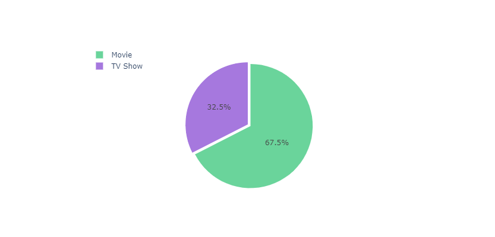
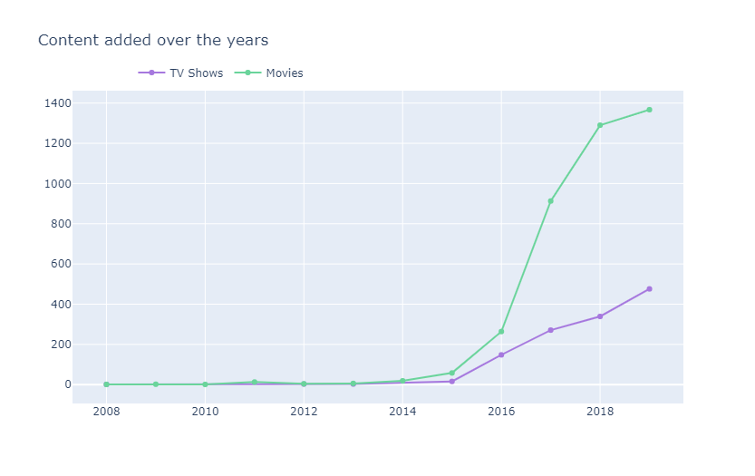
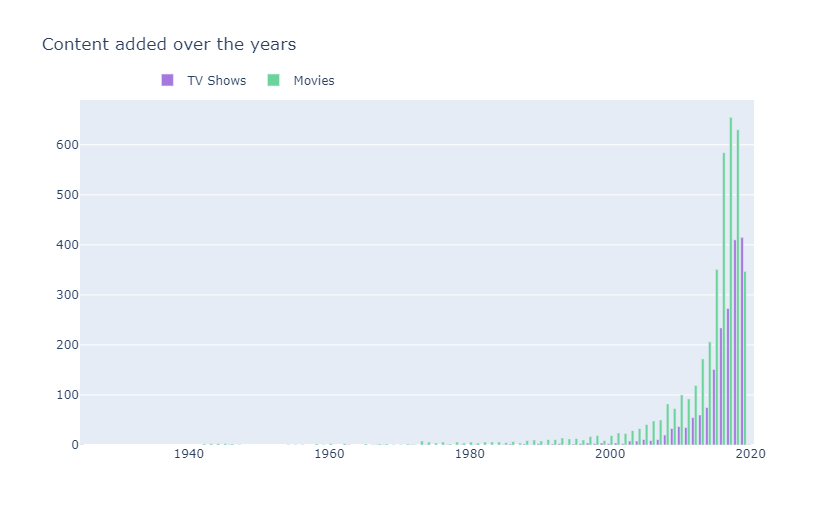
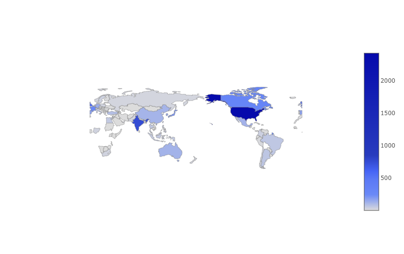
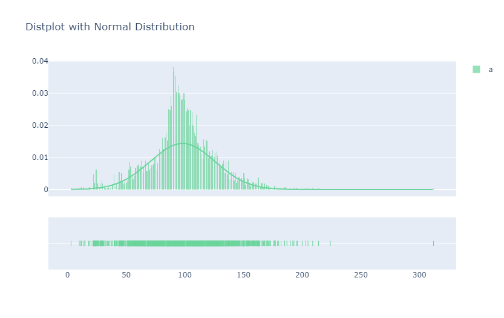
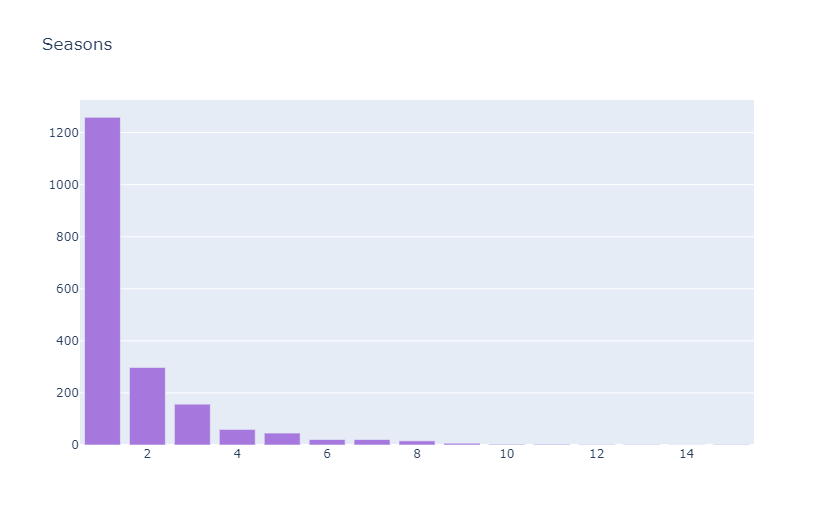
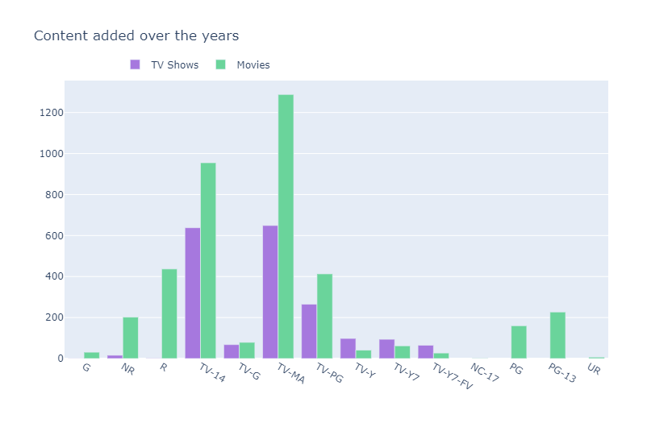
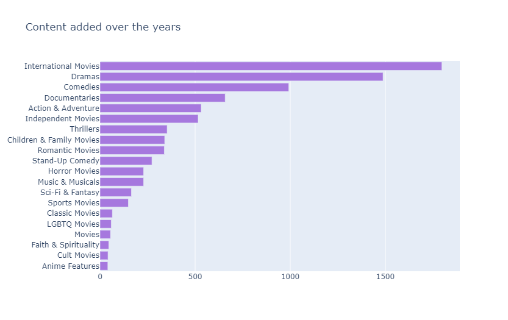
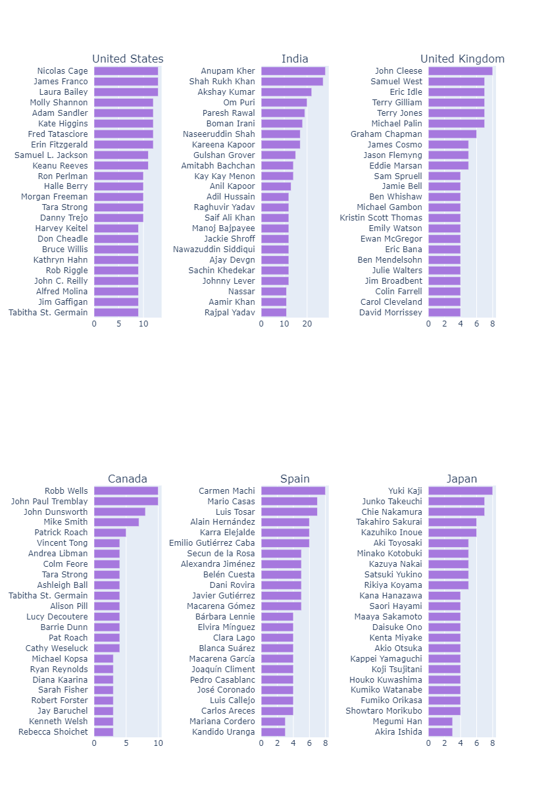

# Netflix Dataset Exploration

This repository contains code to explore the Netflix dataset using Python and Plotly. The dataset used in this project is the "Netflix Titles" dataset from November 2019.

## Overview

The code in this repository explores the Netflix dataset and provides insights into the content available on Netflix. It covers various aspects such as the type of content (movies and TV shows), growth in content over the years, original release years of movies, content from different countries, distribution of movie duration, TV shows with multiple seasons, ratings, top categories, and more.

## Prerequisites

Before running the code in this repository, make sure you have the following prerequisites installed:

- Python
- Plotly
- Pandas

You can install the required Python packages using `pip`:

```
pip install plotly pandas
```

## Code Structure

- `explore_netflix_dataset.ipynb`: Jupyter Notebook containing the code for dataset exploration.
- `data/netflix_titles_nov_2019.csv`: The Netflix dataset used for analysis.

## Running the Code

1. Open the `explore_netflix_dataset.ipynb` Jupyter Notebook.
2. Execute the code cells to generate visualizations and insights.

## Visualizations

Here are some of the visualizations generated using the code:

### 1. Content Type on Netflix



This pie chart shows the distribution of content on Netflix, with 2/3 being movies and 1/3 being TV shows.

### 2. Growth in Content Over the Years



This line chart illustrates the growth of content on Netflix over the years, differentiating between TV shows and movies.

### 3. Original Release Year of Movies



This bar chart displays the distribution of original release years for movies on Netflix.

### 4. Content from Different Countries



A world map visualization showing the countries with the most content available on Netflix.

### 5. Distribution of Movie Duration



This distribution plot visualizes the duration of movies available on Netflix.

### 6. TV Shows with Many Seasons



A bar chart showing the number of seasons in TV shows on Netflix.

### 7. The Ratings of the Content



Bar charts displaying the distribution of content ratings for both TV shows and movies.

### 8. Top Categories



A bar chart illustrating the top content categories on Netflix.

### 9. Top Actors/Directors



Visualizations showcasing the top actors and directors from the United States and other countries.

## Conclusion

This code provides valuable insights into the Netflix dataset, giving you a better understanding of the content available on the platform. Feel free to explore the code and adapt it to your specific analysis needs.

Enjoy exploring the Netflix dataset! If you have any questions or suggestions, please feel free to reach out.

